# Primerira-Pag
<!DOCTYPE html>
<html lang="pb-br">
    <head>
        <meta charset="UTF-8">    </head>
        <body bgcolor="#E0FFFF"> 
<title>PICO DO FRADE</title>

<h1>PICO DO FRADE</h1>

 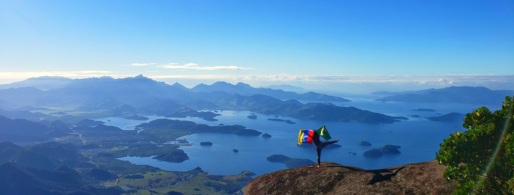
 <ul id="mylist">
   <li><a href="#des"> Descripção</a></li>
   <li><a href="#atri"> A trilha</a></li>
   <li><a href="#dicas"> Dicas</a></li>
   <li><a href="#participantes"> Participantes</a></li>
   <li><a href="#fotos"> Fotos</a></li>

 </ul>

 <h2> Descrição:</h2>
 
É uma formação rochosa com cerca de 1.500 metros de altitude. 
                    Fica no Parque Nacional da Serra da Bocaina, na Serra do Mar  
                    e é um dos pontos mais altos do município de Angra dos Reis no 
                     Estado do Rio de Janeiro.  Nos mirantes dele o panorama é grandioso,  
                    de um lado as montanhas do Planalto da Bocaina, do outro, o litoral de 
                     Angra dos Reis, com suas ilhas, enseadas, a Baía da Ilha Grande e Paraty 
                      ao fundo, o visual é tão surreal que limpa tua alma.
  
                      <video src= "imgs/video.mp4" width="400"heigt="300" controls autoplat></video>

                      <h2>A trilha:</h2>
                      
 São 15 km só de  ida iniciando na região de  
                        Brejal, Zona rural de Bananal, cidade do interior de São Paulo. 
                         Também é possível subir pela vila do Frade, em angra dos reis, 
                          mas por questões de segurança a primeira opção é melhor. 
 
                          <h3>Inicio</h3> 
                          
Iniciamos nosso trekking na pousada Brejal onde 
                             pernoitamos na área de camping para iniciar a trilha assim que 
                              o sol sair. 
                            O Sr. Carlinhos, dono da pousada, conhece a região muito bem e 
                             auxilia com informações referentes da trilha.
                            Também advertiu que constantemente aparecem onças na região.
                            
 
                           
                            

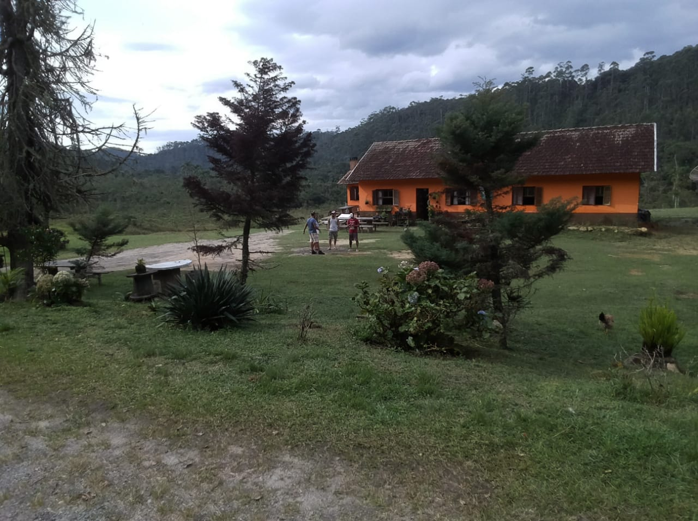
 
                            <h3>Estrada</h3>
                            
 Caminhamos por uma estrada até chegar em uma 
                               porteira de madeira, à esquerda que indica Pousada do Rio Mimoso 
                                a 1,5 Km, mas o caminho segue para a direita, atravessando uma 
                                cerca de arame farpado, passando próximos a algumas casas do lado 
                                 esquerdo e chegando em uma outra porteira, indicando Propriedade 
                                  Particular. 
                              A partir desse ponto a estrada já começa a ficar precária, com vários 
                              pontos de alagamento e alguns brejos. Cerca de 20 minutos depois da 
                               Porteira haverá uma pequena ponte com troncos de árvores sobre um  
                               riacho e a frente aparece o Rio Bonito, logo à esquerda. 
                              
 
                              <h3>Atravessar Rio Bonito</h3>
                              
 Uns 2 minutos à frente abandonamos a precária estrada 
                                 e atravessamos o Rio Bonito para seguir por trilha do outro lado. 
                                O rio tem cerca de uns 10 mts de largura com água até o joelho 
                                 (aqui não existe ponte).
                                

                               

 
                               <h3>Escampado</h3>
                               
 A trilha segue por campo aberto, seguindo sentido sul por  
                                alguns minutos até cruzar com um riachinho, onde existe um brejo e 
                                   daqui para frente a trilha entrará em mata fechada.
                                Daqui em diante é um trecho que passa por diversas áreas de brejo (literalmente  
                                  metemos o pé na lama). Cerca de 30 minutos desde o Rio Bonito, a trilha cruzará 
                                     com outro rio, o Goiabeira, com uns 5 metros de largura.
                                
                               

                               

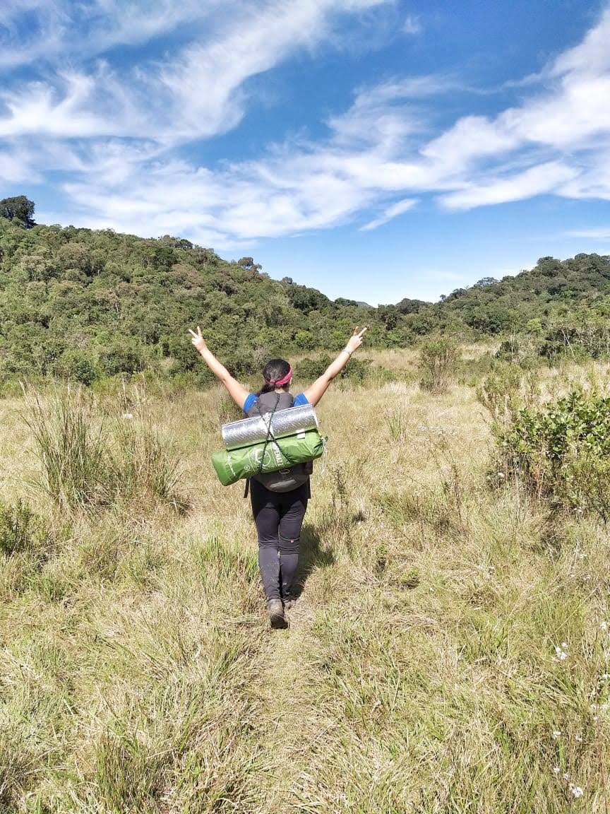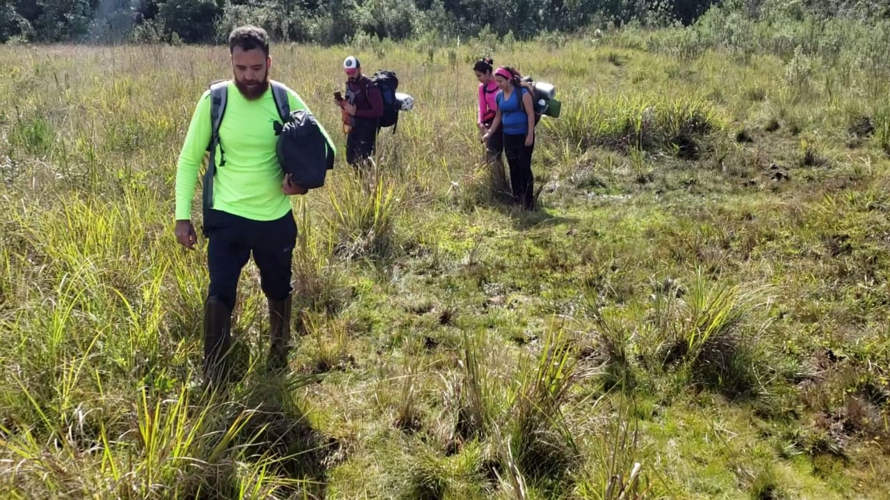
 
                               <h3>Mata adentro </h3>
                               
  Nessa fase inicia o maior trecho do trekking o qual é dentro da mata,  
                                 e a dificuldade está nas varias bifurcações, mato alto e subidas e descidas íngremes. 
                                  São aproximadamente 2 horas de caminhada até chegar em uma gruta. 
                                  Nesse trecho voçe vai saber a importancia de ir com alguem que já tenha feito a trilha. No
                                  nosso caso já um membro do grupo tinha feito e nós guiou. 
                                  

 
                          

                          <h3>Gruta do Alemão </h3>
                          
   Após de andar tanto se chega em uma gruta com uma nascente de agua geladinha  
                            e limpa, não há agua no cume da Pedra do Frade. Então é necessário levar toda a quantidade necessária, 
                             pois é o ultimo ponto de água. Após esse ponto, logo vem a base da pedra e a subida é bastante íngreme.
                             

                             
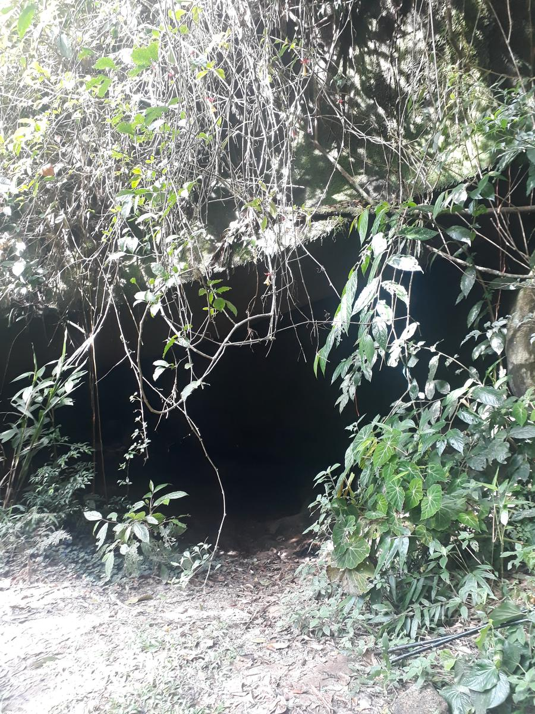
 

                             <h3>Subida final</h3>
                             
  Após de subir por muitas raízes e pedra se chega em um mirante onde da para ver a 
                               pedra no seu maior esplendor e ai que iniciam os trechos técnicos, a maioria requerem muita força 
                                nos braços para enfrentar as  escalaminhadas. 

                                

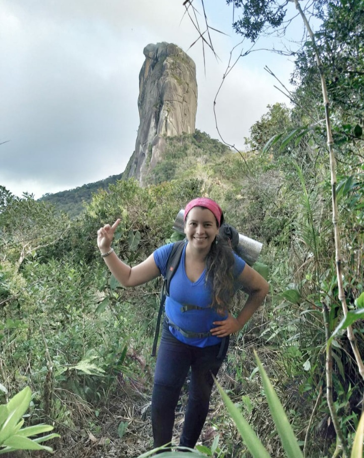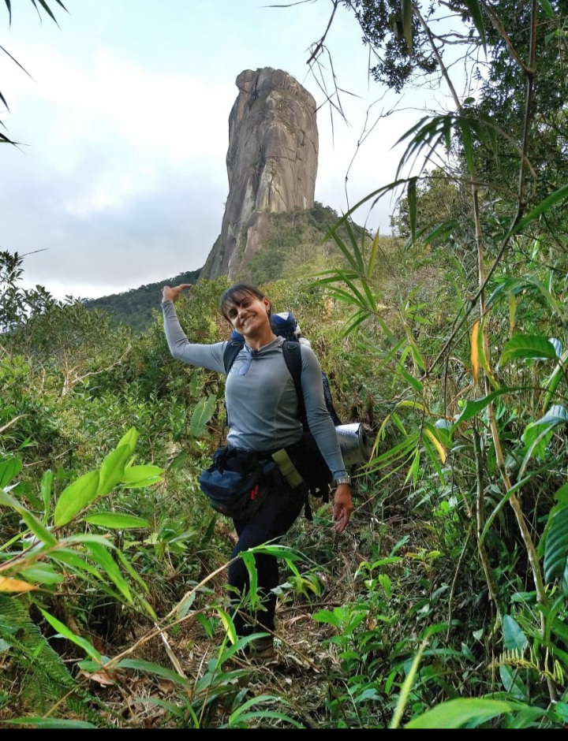
 
                                <h3>Escalada ao cume</h3>
                                
  E a prova final antes de chegar ao cume e ter o melhor visual de recompensa é uma  escada  
                                  feita de bambu e corda, que de tão precária da a sensação que estávamos em um jogo de sorte pela vida mas 
                                   Deus sempre esta com nós e cuido da gente  nesse trecho.

                                   

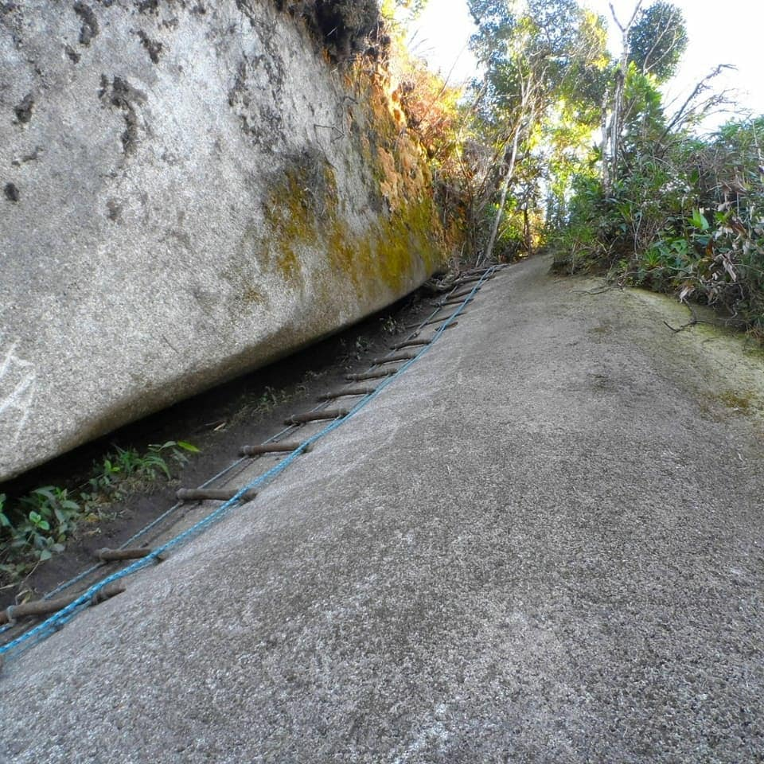

                                   <h3>Chegada ao cume</h3>
                                   
 Vencido o trecho final
                                    Depois de várias fotos e contemplações, armamos nossa barraca e fomos preparar nosso jantar, sob a luz  
                                    intensa de uma lua completamente cheia, que há pouco tinha nascido no horizonte. Um jantar no cume do 
                                     Pico do Frade, com aquela vista maravilhosa e ainda por cima sob lua cheia e um céu estupidamente  
                                     estrelado, num clima de total paz e harmonia. Realmente, não poderíamos pedir mais nada, apenas agradecer 
                                      a chance de podermos vivenciar aqueles momentos, que ficarão, com certeza, gravados pra sempre em nossas 
                                       memórias. 
                                    

                                    

                                    

                                    <h2>Dicas:</h2>
                                    <ol><li> A trilha é pesada e a orientação é difícil. Não é uma trilha para iniciantes.<li> Sempre levar um kit de primeiros socorros e larterna.<li>Leve um reservatório grande de agua  para abastecer na Gruta do Alemão.<li> Levar comidas leves para fazer no cume. <li> Se tiver chovido, os trechos de descampado ficarão cheios de lama e charco.<li> Não faça essa trilha na estação de chuva.<li>Leve materiar de escalada para evitar usar as cordas velhas que estaõ perto do cume.<li> Na noite a temperatura desce bruscamente, então leve boa roupa para o frio.</ol>
                                      <h2>Participantes:</h2>
                                      

                                      <ul><li><a href="https://www.instagram.com/santos_rodrigo_81/?hl=pt-br" target="blank" rel="hoopener"> Rodrigo no instagram

                                        <li><a href="https://www.instagram.com/karli.diazf/?hl=pt-br" target="blank" rel="hoopener"> Karli no instagram
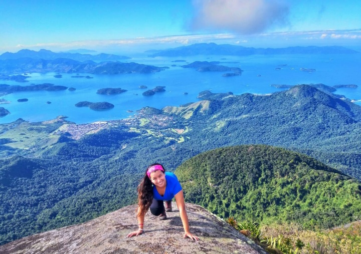

 
                                        <li><a href="https://www.instagram.com/dimii_swagger/?hl=pt-br" target="blank" rel="hoopener"> Dimii no instagram
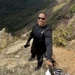

                                          <li><a href="https://www.instagram.com/tati_rsl/?hl=pt-br" target="blank" rel="hoopener"> Tati no instagram
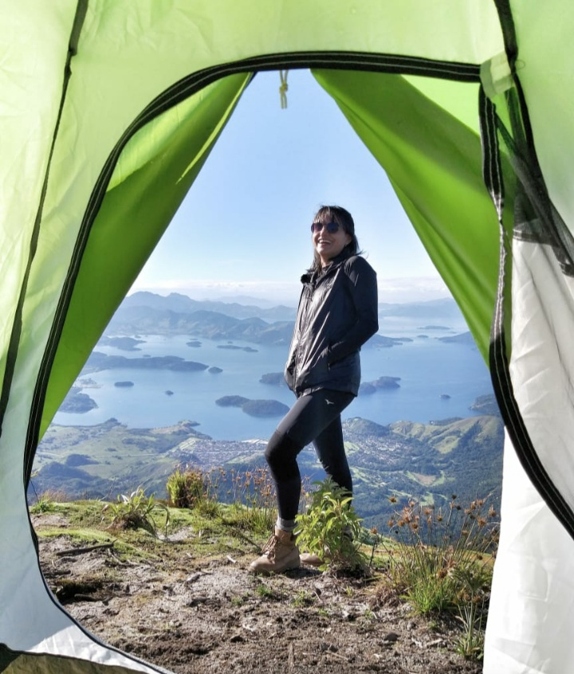 

                                            <li><a href="https://www.instagram.com/p/B-oDZ0WlHZE/" target="blank" rel="hoopener"> Jefferson no instagram
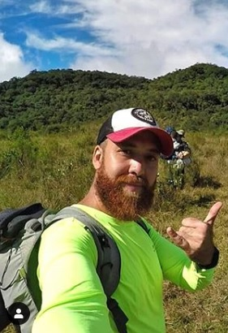 
                                          
 </a></ul> 
                                        <h2>Galeria de Fotos</h2>
                                        

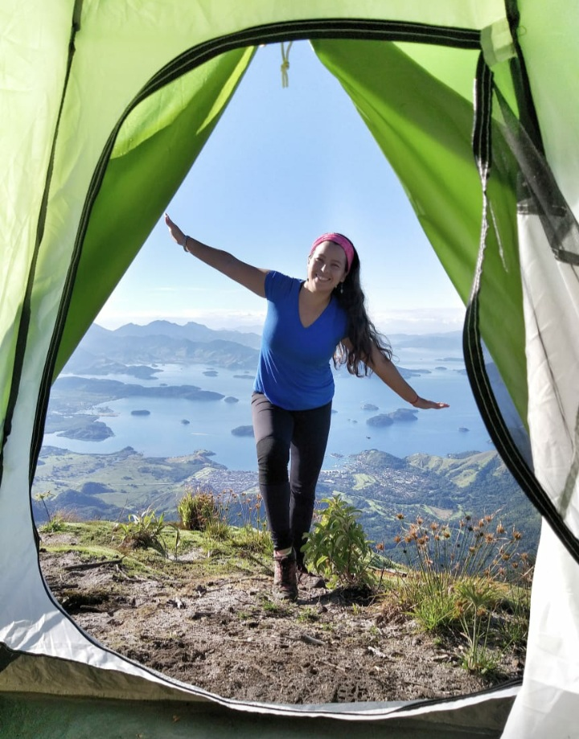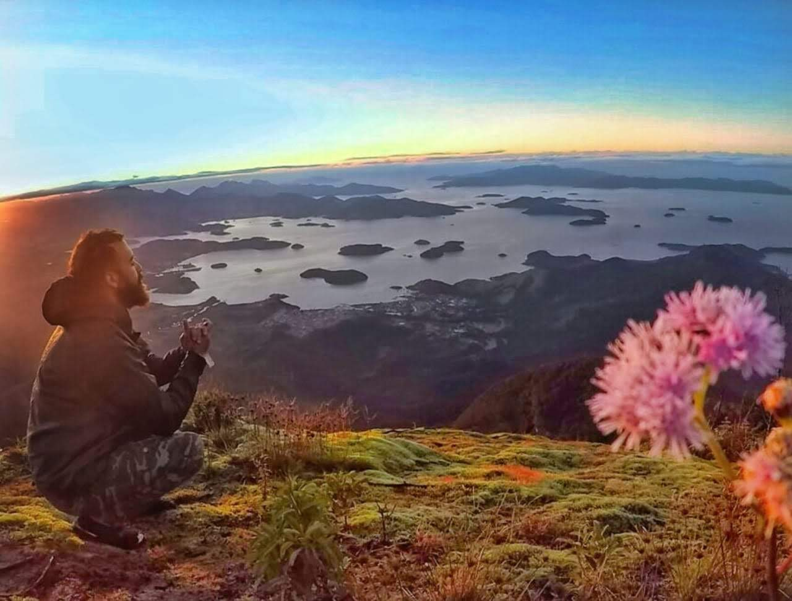
 
                                        

 
                                        

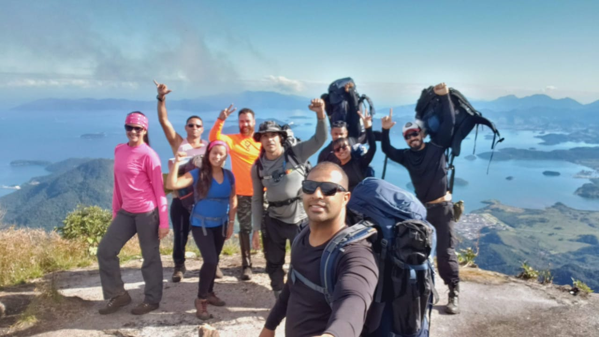

                                        

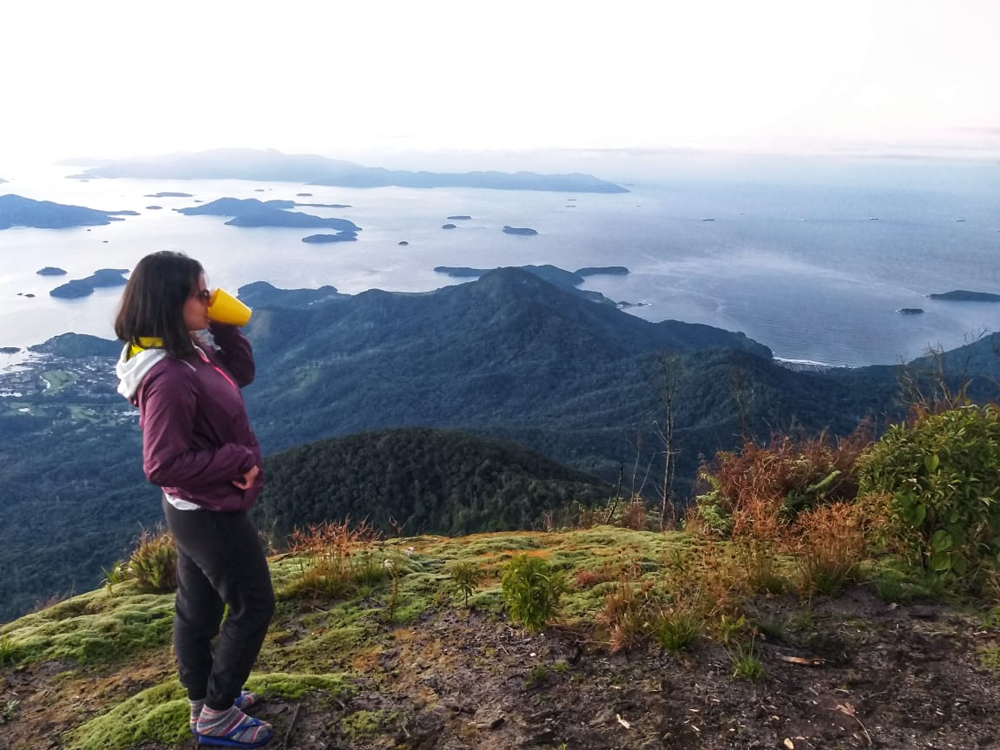

                                       

                                      

</body>
</html>
